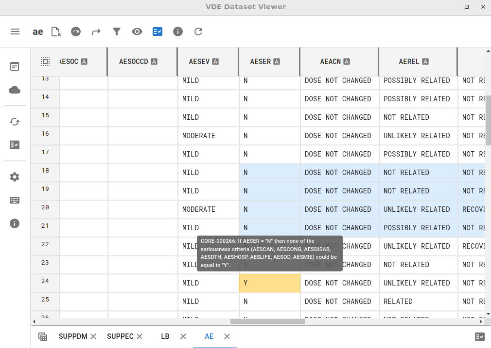

VDE Dataset Viewer

## Description
The VDE Dataset Viewer is a tool designed to help users visualize and explore datasets.

Supported Formats:
* [Dataset-JSON v1.1](https://github.com/cdisc-org/DataExchange-DatasetJson)
* NDJSON representation of Dataset-JSON 1.1
* Compressed Dataset-JSON 1.1
* XPORT v5
* SAS7BDAT

API Specification: [DataExchange-DatasetJson-API](https://github.com/cdisc-org/DataExchange-DatasetJson-API)

## Installation

### Download and Install
You can download installation packages or portable version for your operating system:

1. Visit the [official downloads page](https://defineeditor.com/vde-dataset-viewer/downloads) for the latest stable version
2. Or check the [GitHub Releases](https://github.com/defineEditor/vde-dataset-viewer/releases) page for all versions

### Installation Options
- **Windows**: Run the installer (vde-dataset-viewer.Setup.x.y.z.exe) or use the portable version (vde-dataset-viewer.x.y.z.exe)
- **Linux**: Use the AppImage file (make it executable with `chmod +x filename.AppImage`)
- **From Source**: Follow the Development instructions below to build from source

Supported Formats:
* [Dataset-JSON v1.1](https://github.com/cdisc-org/DataExchange-DatasetJson)
* NDJSON representation of Dataset-JSON 1.1
* Compressed Dataset-JSON 1.1
* XPORT v5
* SAS7BDAT

## Features
* Reading large size datasets
* Multiplatform: Windows, Linux (and MacOS if someone with Mac packages it)
* Filtering with value autocomplete
* Sorting
* Row and column navigation
* Metadata info
* Cell selection
* Column visibility control
* Automatic updates
* Automated testing
* API access

## Viewing Customization Settings
* Numeric date format
* Number rounding
* Dynamic cell height
* Automatic width estimation
* Encoding control

## Development
To develop the VDE Dataset Viewer, follow these steps:
1. Clone the repository: `git clone https://github.com/defineEditor/vde-dataset-viewer.git`
2. Navigate to the project directory: `cd vde-dataset-viewer`
3. Install the dependencies: `npm install`
4. Start the development mode: `npm run start`

## Testing
The VDE Dataset Viewer uses Jest for testing. Tests are located in the `__tests__` folder. To run the tests, use:
1. Execute all tests : `npm test`
2. Run specific tests: `npm test -- <test-file-name>`

## License
This project is licensed under the MIT License - see the [LICENSE](LICENSE) file for details.
